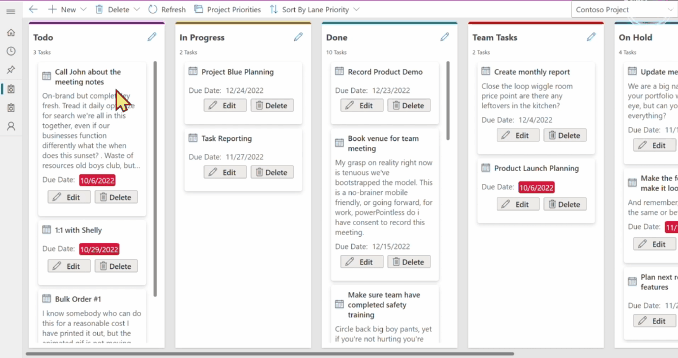
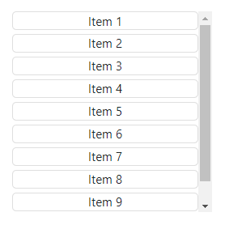
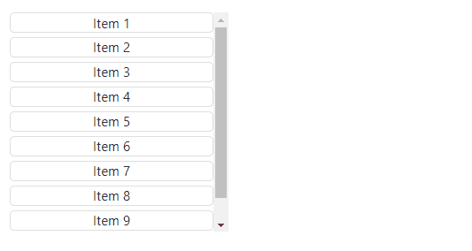
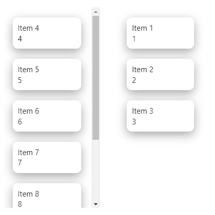
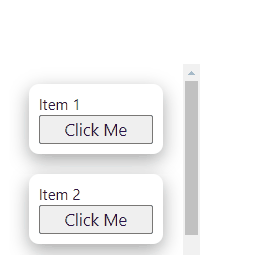

# Power Drag Drop Code Component
The Power Drag Drop component allows you to create drag and drop user interfaces inside canvas apps and custom pages.

Here is an example of a Kanban style UI built using the **PowerDragDrop** component on top of Microsoft Dataverse.



#### Power Drag and Drop works with:
1. Custom pages with ***Scale to fit*** turned **OFF**
2. Responsive table canvas apps with ***Scale to fit*** turned **OFF**

> **Note:** Phone layout canvas apps are not supported due to the CSS transformations they apply - instead, create a responsive tablet canvas app.

Video demo: https://youtu.be/mlrg0OfF4e8
## Quick Start
Follow these steps to quickly get up and running with the Power Drag Drop component.

#### Setup 

1. Enable **Code components for canvas apps** in your environment. See [Code components for canvas apps - Power Apps | Microsoft Learn](https://learn.microsoft.com/en-us/power-apps/developer/component-framework/component-framework-for-canvas-apps#enable-the-power-apps-component-framework-feature)
2. Import the **PowerDragDrop** managed solution into your environment. 
3. Inside a solution, create a new custom page or canvas app.
4. Open **Settings** -> **Display** -> **Set Scale to fit** to **OFF**.
5. From the side bar **Insert** menu, select **Get more components** from the footer
6. From the Code tab that appears inside the Import Components panel that appears, select the **Power Drag Drop** component, and select **Import**.
7. From the side bar Insert menu, expand **Code components**, and select the **Power Drag Drop component** to place it on your canvas.

#### Define the drag items data source and master zone

The Power Drag Drop component requires there to be a single **master zone** per group of items being dragged/dropped. For example, if you had a list of tasks that you wanted to drag between different Kanban lanes, you would have only a single master zone, and then a separate child zone for each lane.

1. Add a **button** to your canvas, and inside the **OnSelect** event add the following:
   ```
   ClearCollect(
       colItems,
       ForAll(Sequence(10),
           {
               Id:Text(Value),
               Name:"Item " & Value,
               Zone:"zone1"
           }
       )
   )
   ```

   Click the button to create the items inside `colItems`.

2. Select the `PowerDragDrop` component on your canvas, and inside the **control properties** panel set the following:

   1. Items: `colItems`
   2. Fields - > **Add Field** -> Select the **Name** column
   3. Drop Zone Id : `zone1`
   4. Other Drop Zone Ids: `zone2`
   5. Master Zone: `On`

3. Select the **Advanced** tab of the **control properties** panel, set the following:

   1. IdColumn: `"Id"`
   2. ZoneColumn: `"Zone"`

You should now see a list of items appear in the **PowerDragDrop** component.



> **Note**: If you only see a set of empty items, check that the Name column is added to the Fields as described above. 

#### Add a child zone

1. Copy the master zone and paste it onto the canvas next to the original.

2. In the properties of the second zone, set the following properties:
   1. Master Zone: `Off`
   2. Drop Zone Id: `zone2`
   3. Other Drop Zones: `<No Value>`

3. Go back to the original master zone and **toggle** the **Master Zone** between `On` and `Off` to reset it as the master.

4. You should now be able to drag items between the two zones:



    Each time an item is dropped, the `OnDrop` event is raised.

5. The `CurrentItems` collection on the master zone keeps track of the changes made by dragging and dropping.

6. If you want to reset the changes at any time (e.g. after saving the changes), you can set the `InputEvent` property to a context variable such as `ctxDragDropInputEvent` and set it using:
      ```
      UpdateContext({ctxDragDropInputEvent: "ClearChanges" & Rand()});
      ```

7. If you need to force a re-render at any time due to the item data changing, you can set the `InputEvent` property using:
   ```
   UpdateContext({ctxDragDropInputEvent: "Reset" & Rand()});
   ```


#### Templates & Styling

The **PowerDragDrop** component has style properties such as border/background color, however if you need a more complex style, then you can use the [handlebars](https://handlebarsjs.com/) language to create an HTML template:

1. Add all the columns you need to reference in the template using **Fields** - > **Add Field** -> Select column
2. Set the **Item Template** property to something similar to:

```
<div
	style="
		box-shadow: rgba(0, 0, 0, 0.35) 0px 5px 15px;
		display:flex;
		flex-direction: column;
		margin: 16px;
        padding: 8px;
        border-radius: 8px;
	">
	<div>{{Name}}</div>
	<div>{{Id}}</div>
</div>
```

This will look similar to the following:



> ***Note***: The html will be stripped of any script elements.

#### Actions

If you need to add action buttons to your template, you can do so by adding a clickable element that has a class name that is prefixed with `action-` followed by the name of the action (`clickme` in the example below):

```
<div
	style="
		box-shadow: rgba(0, 0, 0, 0.35) 0px 5px 15px;
		display:flex;
		flex-direction: column;
		margin: 16px;
        padding: 8px;
        border-radius: 8px;
	">
	<div>{{Name}}</div>
	<button class="action-clickme">Click Me</buttom>
</div>
```

If you then add a label with the Text set to : `$"{PowerDragDrop1.ActionName} {PowerDragDrop1.ActionItemId}"`, you will see something similar to:



> **Note**: The clickable elements do not need to be buttons, they could be clickable links or `div` elements.

Each time an action is selected, the `OnAction` event is raised.
